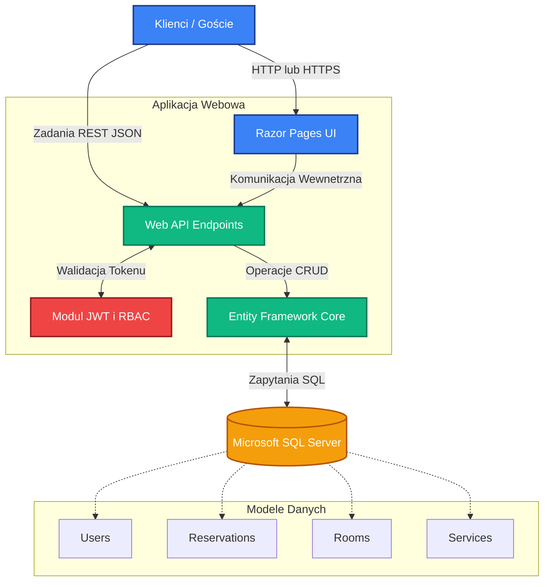

# Opis Projektu

Projekt to system do zarządzania rezerwacjami i ofertą w gospodarstwie agroturystycznym. Został on oparty na architekturze klient-serwer, gdzie backend odpowiada za logikę biznesową i bezpieczeństwo, a frontend (w tym interfejs oparty na Razor Pages i Swaggerze) za interakcję z użytkownikiem.

## Rozwiązania w zakresie bezpieczeństwa

Bezpieczeństwo w projekcie opiera się na dwóch głównych mechanizmach zintegrowanych bezpośrednio w warstwie middleware:

1. **Uwierzytelnianie (JWT):** API zostało zabezpieczone za pomocą tokenów JSON Web Tokens (`Microsoft.AspNetCore.Authentication.JwtBearer`). Każde zabezpieczone żądanie musi posiadać ważny token przekazany w nagłówku `Authorization: Bearer <token>`.
2. **Autoryzacja (RBAC - Role-Based Access Control):** Dostęp do konkretnych końcówek API jest sterowany przy użyciu polityk weryfikujących rolę uwierzytelnionego użytkownika.
   - **Administrator:** Posiada pełny dostęp, w tym możliwość modyfikowania słowników systemowych (pokoi, usług).
   - **Recepcjonista:** Ma dostęp operacyjny do bazy gości i rezerwacji, z zablokowaną możliwością modyfikacji słowników systemowych.
   - **Klient:** Może zarządzać wyłącznie własnymi danymi oraz rezerwacjami.
   - **Gość (Brak uwierzytelnienia):** Posiada dostęp tylko w trybie do odczytu (np. do przeglądania dostępnej oferty).

## Wykorzystane Technologie

System zbudowano z wykorzystaniem nowoczesnych rozwiązań od Microsoftu:
- **.NET 9 / ASP.NET Core API:** Stanowi fundament backendowy do budowania wydajnych i skalowalnych endpointów obsługujących logikę biznesową.
- **Entity Framework Core 9.0:** Mechanizm ORM (Object-Relational Mapping) w podejściu Code-First. Zarządza modelami, migracjami i komunikacją ze strukturą bazy danych.
- **Microsoft SQL Server:** System zarządzania relacyjną bazą danych użyty do trwałego przechowywania modeli systemowych (użytkownicy, pokoje, rezerwacje).
- **ASP.NET Core Razor Pages:** Wykorzystywane do tworzenia warstwy prezentacji po stronie serwera.
- **Swashbuckle.AspNetCore (Swagger):** Umożliwia dokumentację i wizualne testowanie interfejsu API z uwzględnieniem podawania tokenu uwierzytelniającego.

## Architektura Systemu

Poniższy diagram przedstawia ogólną strukturę całego rozwiązania:

