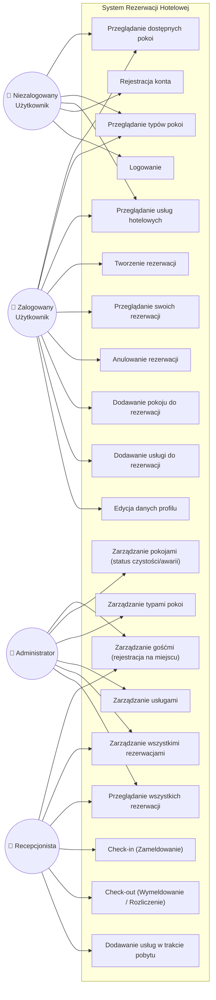
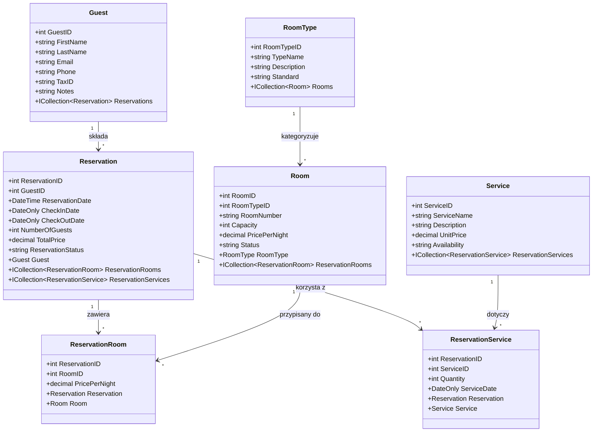
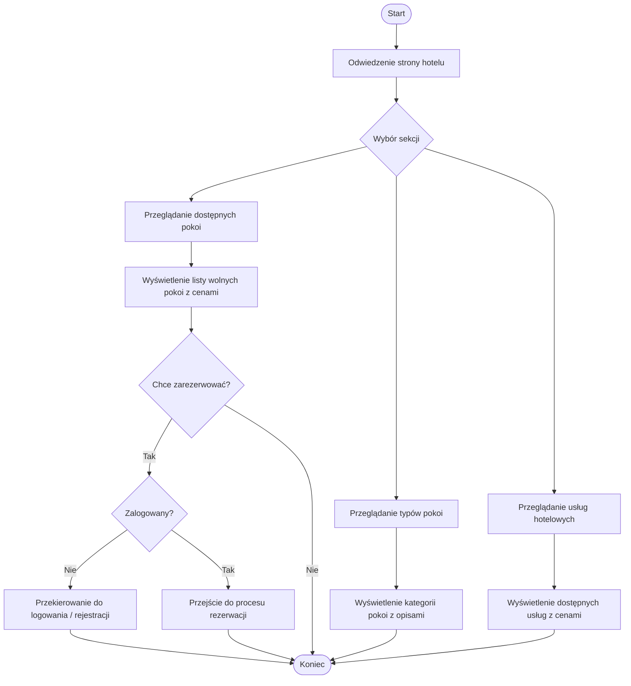
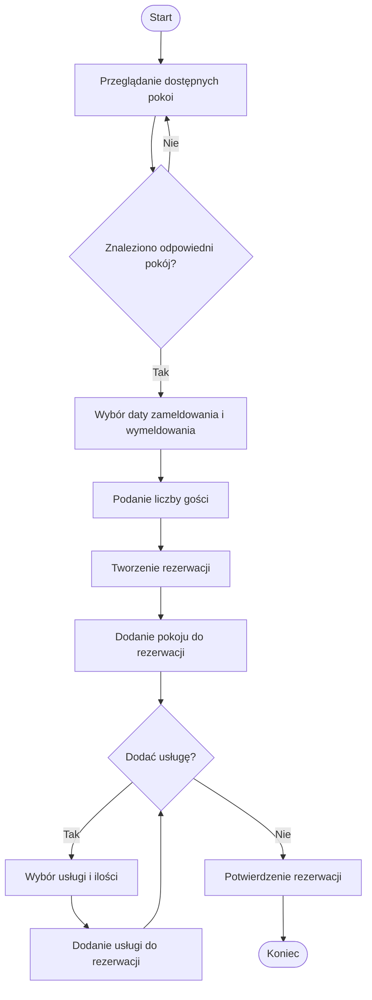
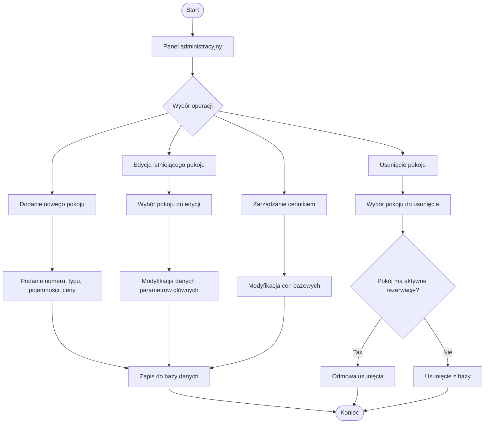
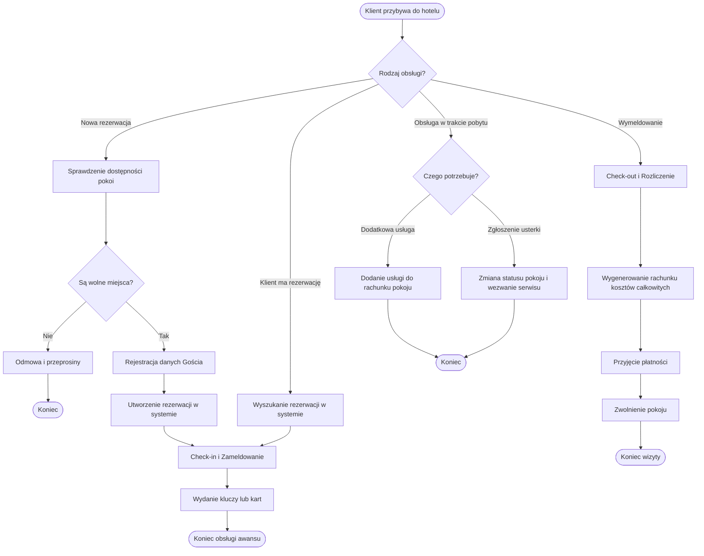
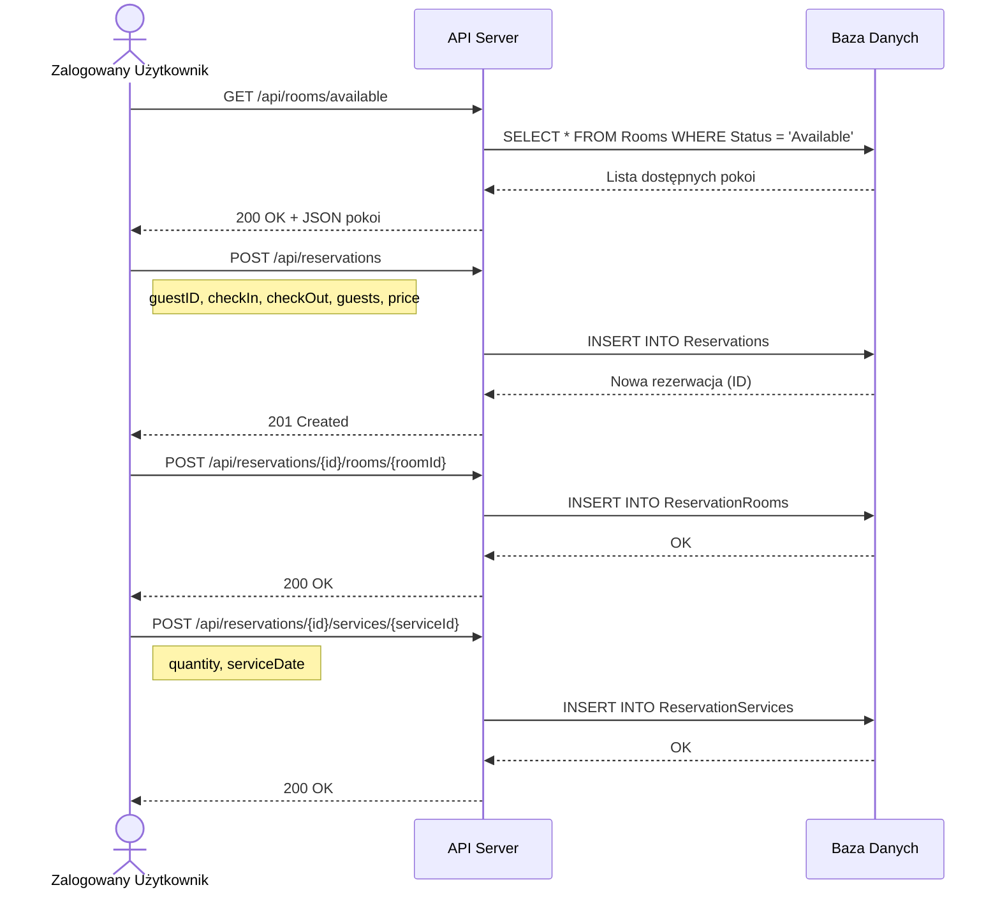
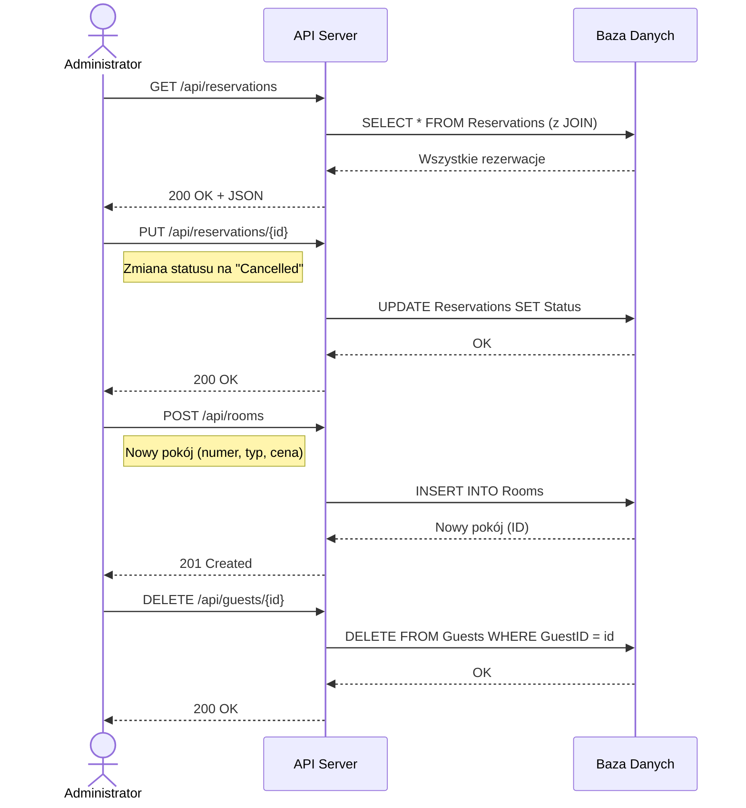
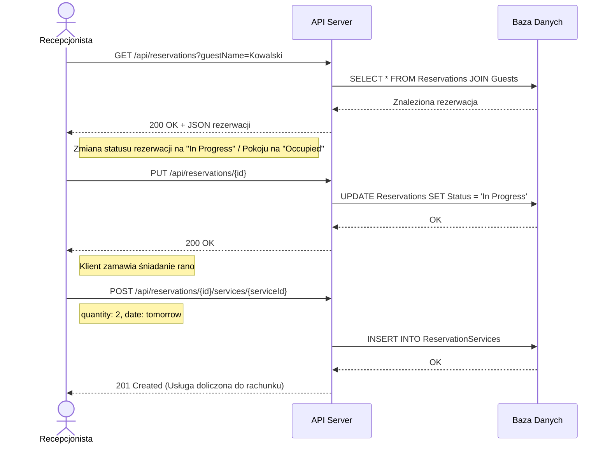

# Diagramy UML — System Rezerwacji Hotelowej

Role w systemie:
1. **Niezalogowany Użytkownik** (Gość) — przeglądanie oferty
2. **Zalogowany Użytkownik** (Klient) — samodzielne rezerwacje i zarządzanie kontem
3. **Recepcjonista** (Obsługa klienta) — obsługa gości na miejscu, zameldowania, rezerwacje telefoniczne, fakturowanie
4. **Administrator** — pełne zarządzanie systemem (konfiguracja pokoi, usług, cenników)

---

## 1. Diagram przypadków użycia (Use Case)

---

## 2. Diagram klas (Class Diagram)

---

## 3. Diagram aktywności — Przeglądanie oferty (Niezalogowany Użytkownik)

---

## 4. Diagram aktywności — Proces rezerwacji (Zalogowany Użytkownik)

---

## 5. Diagram aktywności — Zarządzanie pokojami (Administrator)

---

## 6. Diagram aktywności — Obsługa klienta na miejscu (Recepcjonista)

---

## 7. Diagram sekwencji — Tworzenie rezerwacji (API)

---

## 8. Diagram sekwencji — Zarządzanie zasobami (Administrator)

---

## 9. Diagram sekwencji — Check-in i doliczenie usługi (Recepcjonista)

